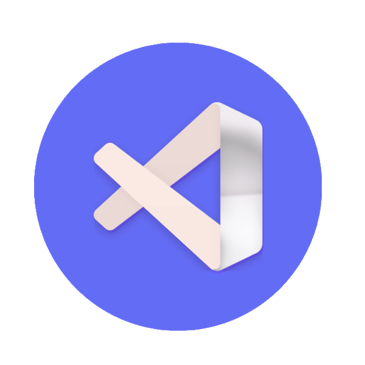
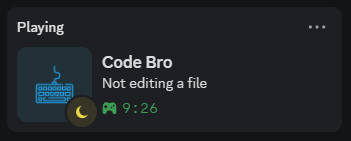
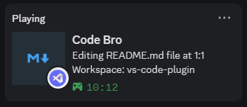
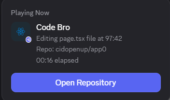

<div align="center">
  


</div>

# Minimal Discord Rich Presence
Minimal Discord Rich Presence connects **Visual Studio Code** with **Discord Rich Presence**, showing what you’re working on in real time. It updates your Discord status with your current file, workspace, and cursor position as you code.

## Features

* Shows the file you’re currently editing and your cursor position
* Displays the name of the workspace you’re working in
* Detects your current Git repository and shows it in your Rich Presence state
* Adds an **Open Repository** button in Discord Rich Presence when a repository remote is available
* Updates your Discord status based on the type of file you’re editing (JavaScript, Python, TypeScript, and more)
* Can be reloaded at any time to refresh activity tracking
## Preview
<div style="text-align:left">
  
</div>

<div style="text-align:left">
  
</div>

<div style="text-align:left">
  
</div>

## Commands

* **Reload Rich Presence** — Refreshes the Rich Presence information
* **Reconnect Rich Presence** — Reconnects to Discord if the connection drops
* **Disconnect Rich Presence** — Stops sharing activity with Discord

## Installation

You can install the extension using **VS Code Quick Open** (`Ctrl+P`). Paste the command below and press Enter:

```
ext install cidopenup0.minimal-discord-rpc
```

Or install it manually:

1. Open **VS Code**
2. Go to the **Extensions** view
3. Search for **Minimal Discord Rich Presence**
4. Click **Install** on the extension by `cidopenup0`

## Usage

Once installed, the extension starts tracking your editor activity automatically.
If you want to manually update your Discord status, just run the **Reload Rich Presence** command.

### Repository Button in Rich Presence

The extension checks whether your active workspace is a Git repository.

* If a repository exists and has an `origin` remote URL, Rich Presence includes an **Open Repository** button linking to that repository.
* SSH remotes such as `git@github.com:user/repo.git` are converted to an HTTPS link for Discord.
* If no repository (or no `origin` remote) is found, the repository button is not shown.

## Contributing

Contributions are welcome. If you’d like to help improve the project:

1. Fork or clone the main branch
2. Create a new branch for your changes
3. Make your updates
4. Commit and push your changes
5. Open a pull request [here](https://github.com/cidopenup0/discord-vscode/pulls)

## Thanks

* [@xhayper/discord-rpc](https://github.com/xhayper/discord-rpc) — Discord RPC client library
* [simple-git](https://github.com/steveukx/git-js) — Git wrapper used for repository detection and remote URL handling

## Inspiration

* [narcisbugeag](https://github.com/narcisbugeag) — Creator of [VSCord](https://github.com/narcisbugeag/vscord/)

## Support

If you find this extension useful, consider giving the repository a star on GitHub. It helps a lot and encourages further development.